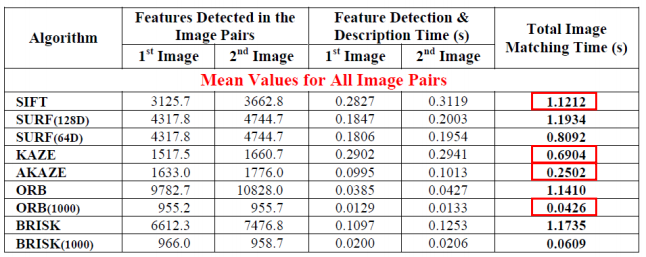
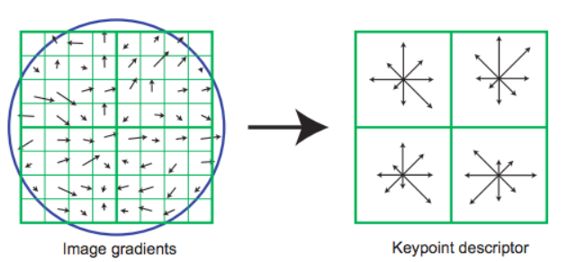
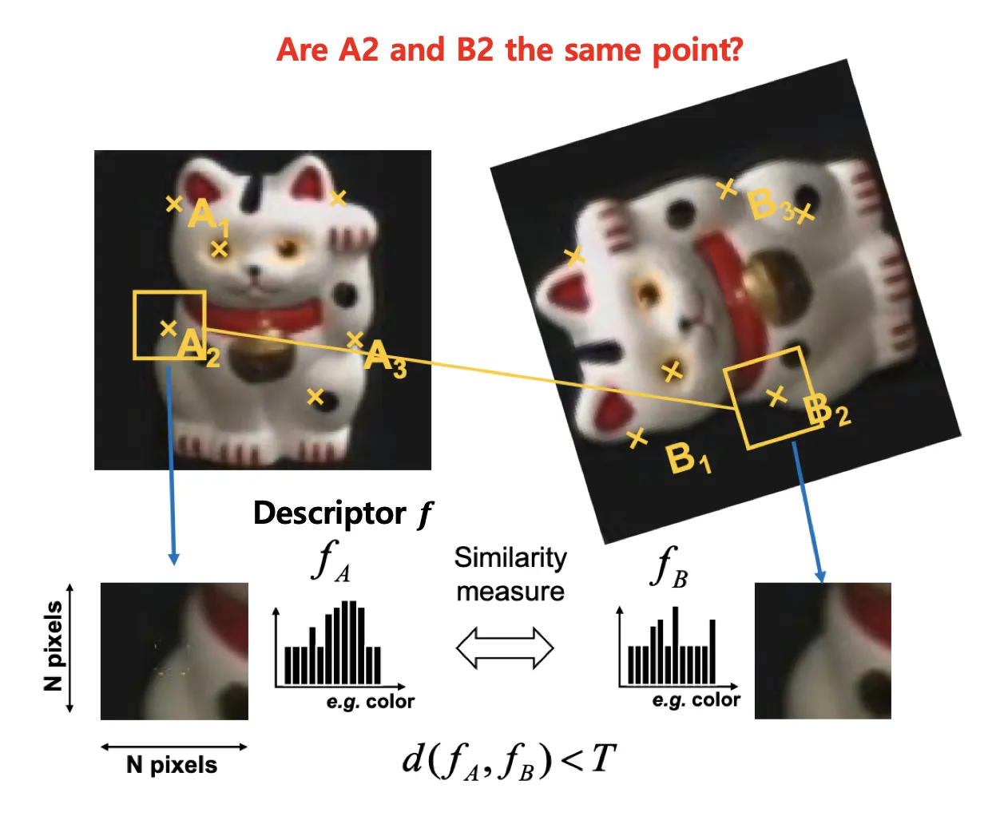
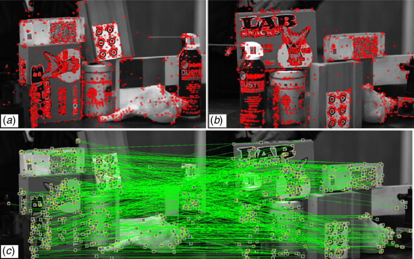

## GitHub

[https://github.com/pablofdezalc/kaze](https://github.com/pablofdezalc/kaze)

## Paper

[https://www.doc.ic.ac.uk/~ajd/Publications/alcantarilla_etal_eccv2012.pdf](https://www.doc.ic.ac.uk/~ajd/Publications/alcantarilla_etal_eccv2012.pdf)

## Explanation

### Feature detection & Description

두 이미지의 유사점을 추출하고 비교하기 위해 Feature Detection & Description 알고리즘을 사용했습니다.

많은 Feature Detection & Description 알고리즘이 있지만, 정확도와 속도를 종합적으로 고려하여 KAZE 알고리즘을 사용했습니다.

KAZE 의 Descriptor 는 방향 성분으로 부분 영상의 특징을 실수 정보로 저장합니다.

부분영상을 추출하여 Gradient 방향 성분에 대한 히스토그램을 추출, 각각의 작은 구역에서 방향 히스토그램을 계산합니다.

두 이미지가 동일한 KAZE Interest Point 를 많이 가지고 있을수록 높은 유사도를 갖는다고 판단, 높은 점수를 부여합니다.