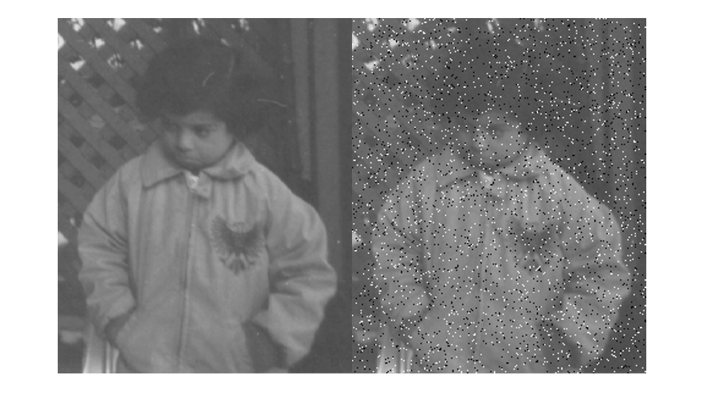
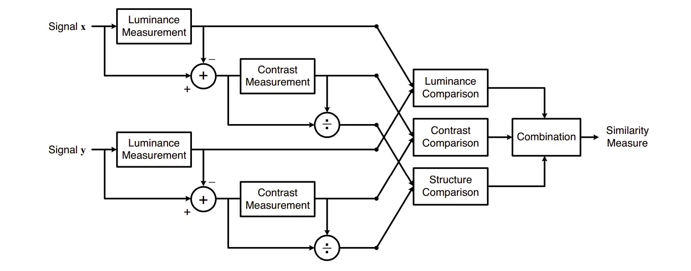

## Explanation

SSIM 은 휘도(Luminance), 대비(Contrast), 구조(Structure) 를 종합적으로 평가합니다.

단순 픽셀간 비교가 아니라, 영상을 구성하는 주요 요소(휘도, 대비, 구조)를 비교합니다.

0~1 사이의 실수값을 가지며, 1에 가까울수록 유사도가 높다는 의미입니다.

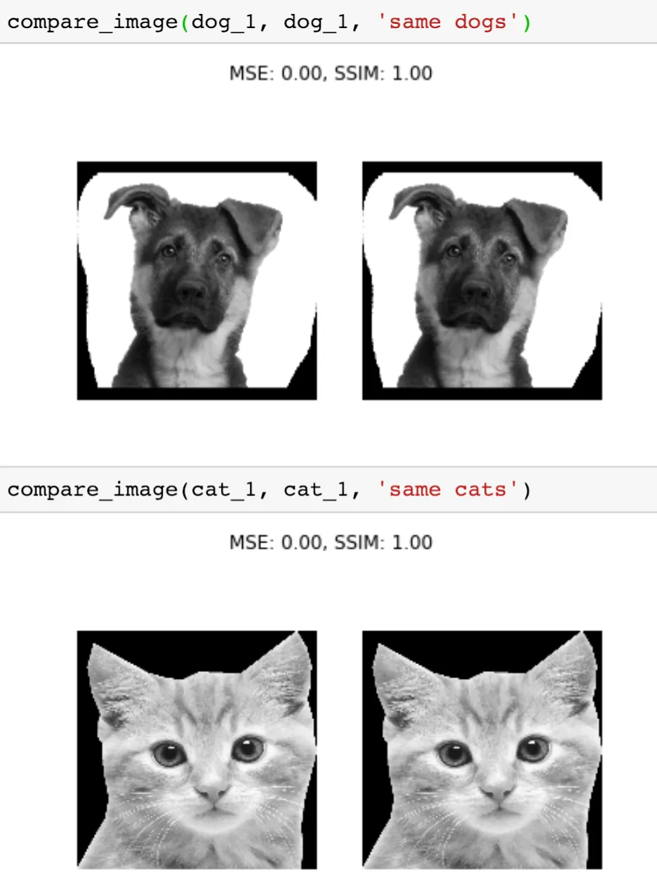
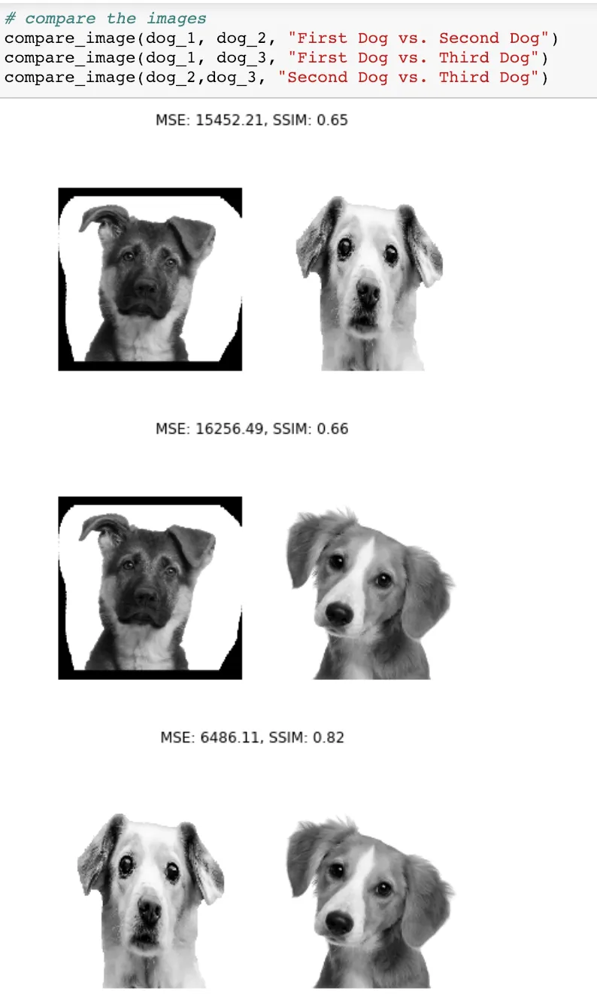
---

완전히 동일한 사진의 경우 SSIM = 1.0 입니다.

강아지 3종을 2마리씩 비교했을 경우 SSIM = 0.65, 0.66, 0.82 로 측정되었습니다.

---

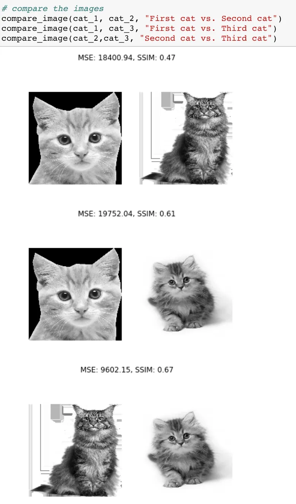
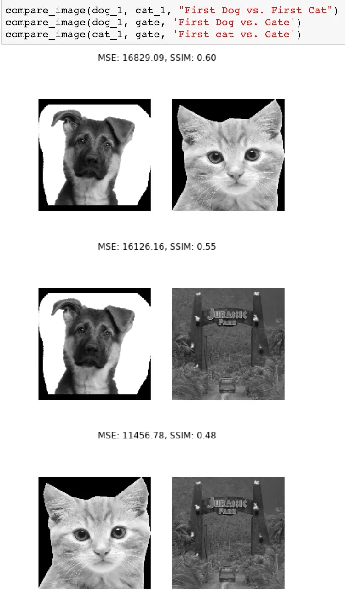

---

고양이 3종을 2마리씩 비교했을 경우 SSIM = 0.47, 0.61, 0.67 로 측정되었습니다.

고양이-강아지 를 비교했을 경우 SSIM = 0.60 입니다.

강아지-게이트 를 비교했을 경우 SSIM = 0.55 입니다.

고양이-게이트 를 비교헀을 경우 SSIM = 0.48 입니다.

- 휘도(Luminance): 빛의 밝기를 나타냅니다.

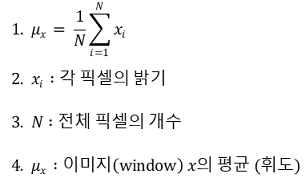

- 대비(Contrast): 이미지 내에서 급격한 변화가 이루어지는 정도입니다.

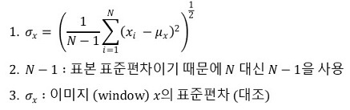

- 구조(Structure): 픽셀들의 상대적 위치로부터 생성되는 특징입니다.

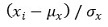

- Luminance comparison function

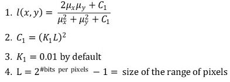

- Constrast comparison function

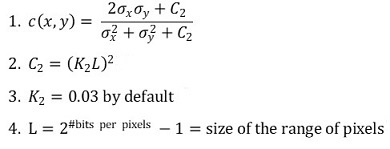

- Structure comparison function

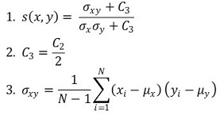

- SSIM

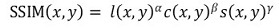
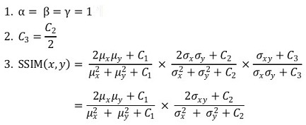
