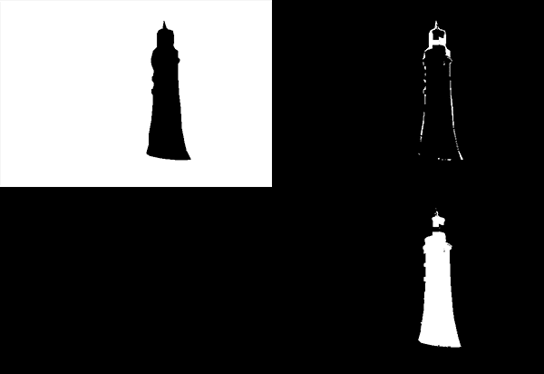
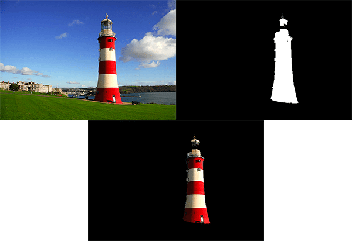

## Paper

https://cvg.ethz.ch/teaching/cvl/2012/grabcut-siggraph04.pdf

## Visual Explanation

◀ Original Image / ▶ Grabcut Result

* Mask 
  * Definite background (top-left): cv2.GC_BGD 
  * Probable background (top-right): cv2.GC_PR_BGD 
  * Definite foreground (bottom-left): cv2.GC_FGD 
  * Probable foreground (bottom-right): cv2.GC_PR_FGD

  

◀ Original Image / ▼ Grabcut Result  / ▶ Mask initialization

## Explanation

그랩컷은 그래프 컷(graph cut)기반 영역 분할 알고리즘입니다.

그래프 알고리즘에서 사용되는 미니멀 컷 알고리즘을 이용해서 영역을 분할합니다.

영상의 픽셀을 그래프 정점으로 간주하고, 픽셀들을 두 개의 그룹(객체 그룹, 배경 그룹)으로 분할하는 최적의 컷(Max Flow Minimum Cut)을 찾는 방식입니다.

이 알고리즘으로 객체와 배경을 구분할 수 있습니다.

사각형으로 객체 부분을 검출하고, 마스킹을 통해 전경과 후경을 분리합니다.
