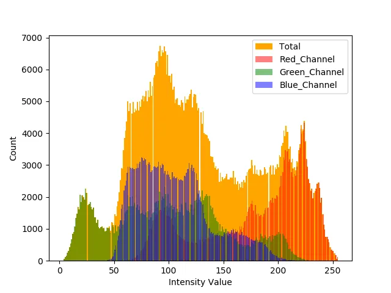
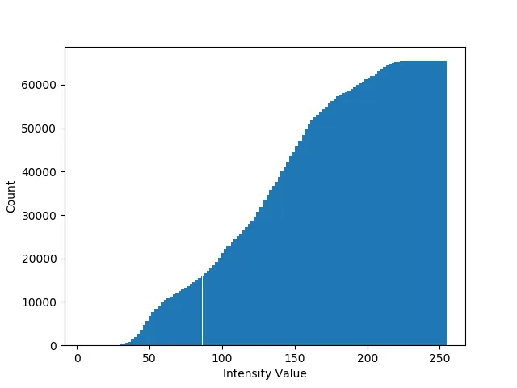

## Visual Explanation

## Explanation

이미지 히스토그램 분석은 이미지를 3개의 채널(R,G,B)로 분할하여 각 성분의 세기(Intensity)의 빈도(frequency)와 분포(distribution**)** 측정합니다.

두 이미지로부터 히스토그램을 각각 추출하여, 두 히스토그램 간 차이(error)를 수치화합니다.

오차가 클수록 두 이미지의 차이가 심하다(유사도가 낮다)는 의미입니다.