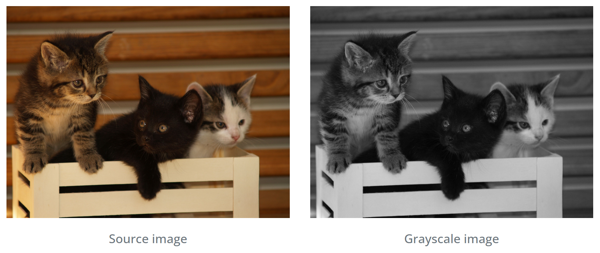
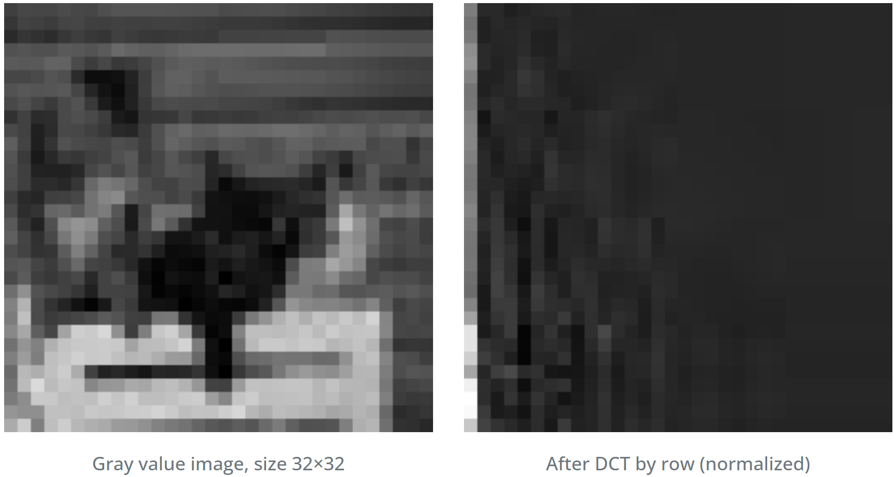
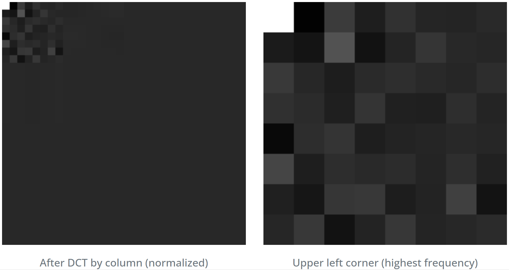
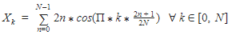

## Visual Explanation

## Explanation

Perceptual Hashing 은 4를 factor 로 하여 타겟 이미지를 32×32 이미지로 scale down 을 수행합니다.

타겟 이미지에 이산 코사인 변환(Discrete cosine transform)을 행별로 수행 후, 열별로 수행합니다.

이산 코사인 변환(Discrete cosine transform)은 다음과 같습니다.

높은 빈도로 등장하는 픽셀(high-frequencies pixels)은 좌측 상단 모서리에 위치하게 됩니다.

다음으로, 전체 이미지의 회색 중앙값(grayscaled median)을 계산합니다.

중앙값을 기준으로 바이너리 해싱을 수행해 결과를 반환합니다.

해시값의 차이가 클수록(distance) 두 이미지의 유사도가 낮다는 의미입니다.