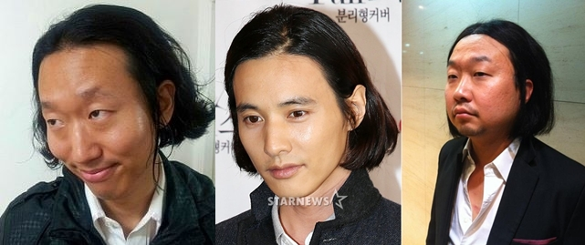
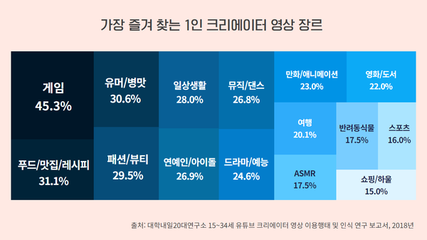
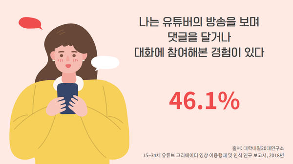

# 기획 배경

### 가장 익숙한 유머 '따라하기'

특정 인물, 동물, 사물 등을 흉내내는 것은 가장 원초적인 코미디였습니다. 학교 선생님이나 개그맨을 흉내내며 놀았던 경험이 다들 있으실겁니다.

그렇기에 가장 단순하지만 즐거운 놀이 '흉내내기'에 저희는 관심을 가졌고, 내가 얼마나 닮았는지를 서로 비교하며 놀 수 있으면 좋겠다고 생각했습니다.

저희는 webRTC 기술을 이용해서 실시간 사진을 촬영하고 이미지 분석 알고리즘을 이용해 유사도를 측정하여 승부를 가리는 게임, '똑딱'을 만들기로 결심했습니다.

# 상업적 가능성

### 나도 스트리머, BJ와 함께 참여하고 싶어
최근 많은 사람들이 개인 미디어를 즐기고 있습니다. 그 중에서 가장 많은 비중을 차지하는 것이 게임이고, 적극적으로 방송에 참여하는 인원도 증가하고 있습니다.

'똑딱' 캐주얼 웹게임으로써 공간적 제약이 없이 함께 게임을 진행 할 수 있고, 게임 과정에서의 재미난 장면이 기대 가능하기 때문에 스트리머의 '시청자 참여 컨텐츠'로써의 성장을 기대하고 있습니다.

