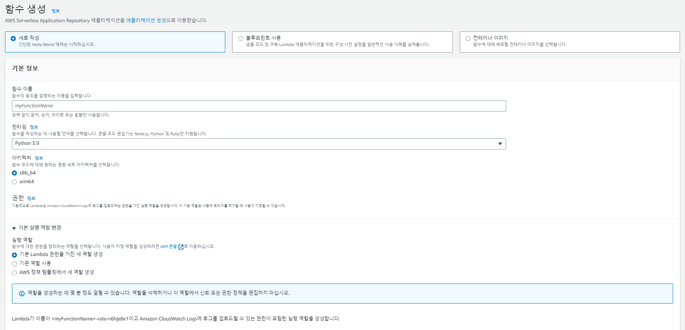

# AWS Lambda 설정

## **Lambda 함수 생성하기**

아시아 태평양 (서울) 리전에서 '함수 생성'



* 함수 이름: 'ImageSimilarity'
* 런타임 정보: Python 3.9
* 아키텍처: x86

람다 함수 생성 확인 후,

/ImageSimilarity/multiplay/lambda_function.py

↑ 위 파일을 생성한 람다 함수에 추가

## **Import Libraries**

### **Headless OpenCV**

https://github.com/076923/aws-lambda-python-opencv-layer

Support Pre-built Python 3.9.16

based on Numpy == 1.24.2

* opencv-python-headless-3.4.18.65
* opencv-python-headless-4.4.0.46
* opencv-python-headless-4.5.5.64
* opencv-python-headless-4.6.0.66
* opencv-python-headless-4.7.0.68

위 리포지토리에서 python 3.9.16 / opencv-python-headless-4.6.0.66.zip 다운로드

### **S3 Bucket**


'ddockddack-libs' 버킷 생성 후 다운로드받은 headless opencv zip 파일 업로드

Amazon 리소스 이름(ARN) 및 객체 URL 확인

### **Lambda Layer**


Lambda 추가 리소스 - 계층(Layer) 메뉴 - 계층(Layer) 생성


* 레이어 이름: opencv460
* Amazon S3 에서 업로드 체크
* 위에서 생성한 OpenCV S3 bucket URL 입력


생성한 레이어의 '버전 ARN' 확인

### **Add Layer**


생성한 람다 함수에서 레이어 추가 'Add Layer'

 

함수 런타임 설정 확인 후

'ARN 지정' 체크, 이전 단계에서 생성했던 레이어의 ARN 입력

레이어 라이브러리 추가 및 연결 완료한 후

lambda 함수의 import 부분

```
import cv2
import numpy as np
```

에서 에러 표시가 없어졌는지 (제대로 import 되었는지) 확인

## **API Gateway**

 

### **API 생성하기**

 

API 유형 선택에서 REST API 선택

프로토콜: REST
새 API 생성: 새 API
API 이름: simil

### **메서드 생성 및 연결하기**

 